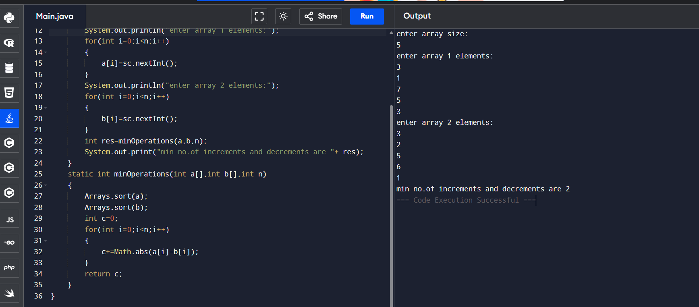

  ## 1.Making elements of two arrays same with minimum increment or decrement operations
  
import java.util.*;
class Main {
    public static void main(String[] args) {
        Scanner sc=new Scanner(System.in);
        System.out.println("enter n");
        int n=sc.nextInt();
        int a[]=new int[n];
        int b[]=new int[n];
        System.out.println("enter elements into array");
        for(int i=0;i<n;i++)
        {
            a[i]=sc.nextInt();
        }
        for(int i=0;i<n;i++)
        {
            b[i]=sc.nextInt();
        }
        int res=minOperations(a,b,n);
             System.out.print("min no.of increments and decrements are "+res);
    }
    static int minOperations(int a[],int b[],int n)
    {
        Arrays.sort(a);
        Arrays.sort(b);
        int c=0;
        for(int i=0;i<n;i++)
        {
            c+=Math.abs(a[i]-b[i]);
        }
        return c;
    }
}

