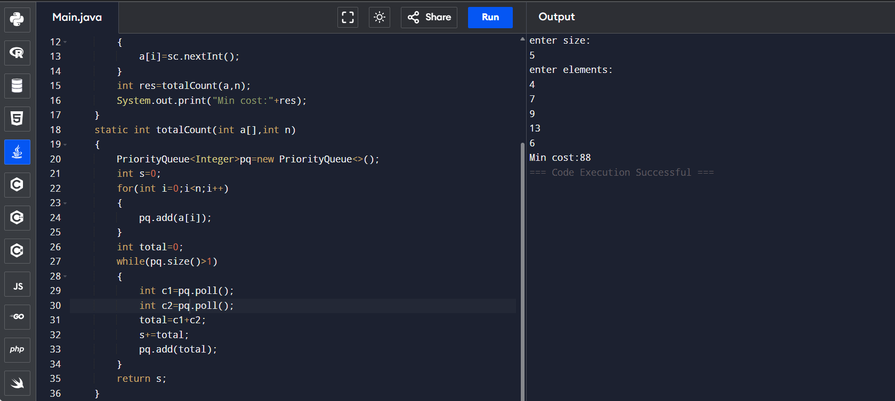

## 10.Connect n ropes with minimum cost'
```
// Online Java Compiler
// Use this editor to write, compile and run your Java code online
import java.util.*;
class Main {
    public static void main(String[] args) {
        Scanner sc=new Scanner(System.in);
        System.out.println("enter size:");
        int n=sc.nextInt();
        int a[]=new int[n];
        System.out.println("enter elements:");
        for(int i=0;i<n;i++)
        {
            a[i]=sc.nextInt();
        }
        int res=totalCount(a,n);
        System.out.print("Min cost:"+res);
    }
    static int totalCount(int a[],int n)
    {
        PriorityQueue<Integer>pq=new PriorityQueue<>();
        int s=0;
        for(int i=0;i<n;i++)
        {
            pq.add(a[i]);
        }
        int total=0;
        while(pq.size()>1)
        {
            int c1=pq.poll();
            int c2=pq.poll();
            total=c1+c2;
            s+=total;
            pq.add(total);
        }
        return s;
    }
}

```

