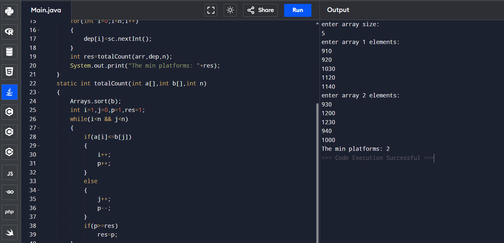

## Minimum number of platforms require in railway station

```
import java.util.*;
class Main {
    public static void main(String[] args) {
        Scanner sc=new Scanner(System.in);
        System.out.println("enter array size:");
        int n=sc.nextInt();
        int arr[]=new int[n];
        int dep[]=new int[n];
        System.out.println("enter array 1 elements:");
        for(int i=0;i<n;i++)
        {
            arr[i]=sc.nextInt();
        }
        System.out.println("enter array 2 elements:");
        for(int i=0;i<n;i++)
        {
            dep[i]=sc.nextInt();
        }
        int res=totalCount(arr,dep,n);
        System.out.print("The min platforms: "+res);
    }
    static int totalCount(int a[],int b[],int n)
    {
        Arrays.sort(b);
        int i=1,j=0,p=1,res=1;
        while(i<n && j<n)
        {
            if(a[i]<=b[j])
            {
                i++;
                p++;
            }
            else
            {
                j++;
                p--;
            }
            if(p>=res)
                res=p;
        }
        return res;
    }
}
```


