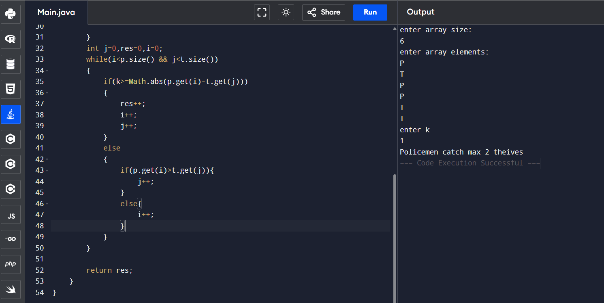

## Police catch thieves
```
import java.util.*;
class Main {
    public static void main(String[] args) {
        Scanner sc=new Scanner(System.in);
        System.out.println("enter array size:");
        int n=sc.nextInt();
        char a[]=new char[n];
        System.out.println("enter array elements:");
        for(int i=0;i<n;i++)
        {
            a[i]=sc.next().charAt(0);
        }
        System.out.println("enter k");
        int k=sc.nextInt();
        int res=maxTheives(a,n,k);
        System.out.print("Policemen catch max "+res+" theives");
    }
    static int maxTheives(char a[],int n,int k)
    {
        ArrayList<Integer>p=new ArrayList<>();
        ArrayList<Integer>t=new ArrayList<>();
        for(int i=0;i<n;i++)
        {
            if(a[i]=='P'){
                p.add(i);
            }
            else{
                t.add(i);
            }
            
        }
        int j=0,res=0,i=0;
        while(i<p.size() && j<t.size())
        {
            if(k>=Math.abs(p.get(i)-t.get(j)))
            {
                res++;
                i++;
                j++;
            }
            else
            {
                if(p.get(i)>t.get(j)){
                    j++;
                }
                else{
                    i++;
                }
            }
        }
        
        return res;
    }
}
```


