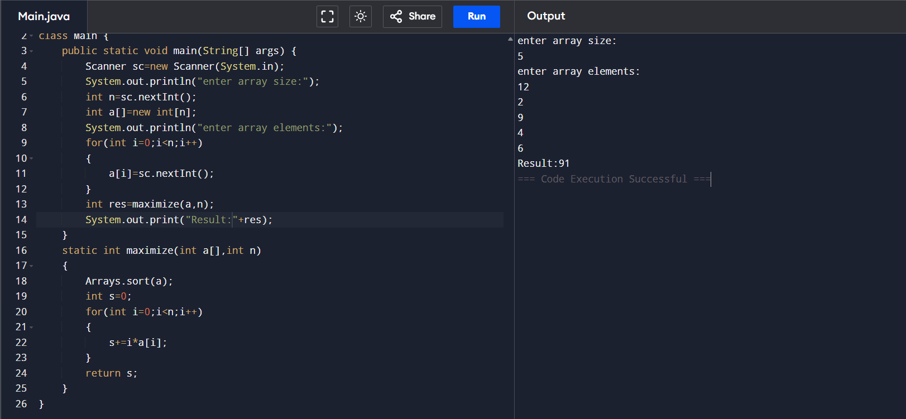

## Maximize the sum of arr[i]*i

```
import java.util.*;
class Main {
    public static void main(String[] args) {
        Scanner sc=new Scanner(System.in);
        System.out.println("enter array size:");
        int n=sc.nextInt();
        int a[]=new int[n];
        System.out.println("enter array elements:");
        for(int i=0;i<n;i++)
        {
            a[i]=sc.nextInt();
        }
        int res=maximize(a,n);
        System.out.print("Result:"+res);
    }
    static int maximize(int a[],int n)
    {
        Arrays.sort(a);
        int s=0;
        for(int i=0;i<n;i++)
        {
            s+=i*a[i];
        }
        return s;
    }
}
```

