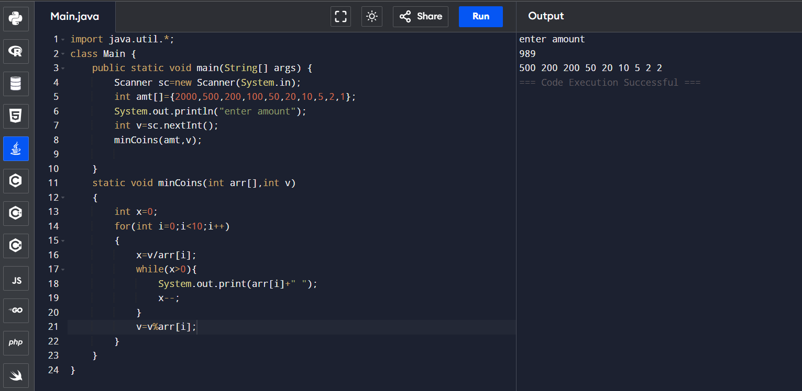

## 5.Note or coin change problem.
```
import java.util.*;
class Main {
    public static void main(String[] args) {
        Scanner sc=new Scanner(System.in);
        int a[]={2000,500,200,100,50,20,10,5,2,1};
        System.out.println("enter amount");
        int v=sc.nextInt();
        minCoins(a,v);
            
    }
    static void minCoins(int a[],int v)
    {
        int x=0;
        for(int i=0;i<10;i++)
        {
            x=v/a[i];
            while(x>0){
            System.out.print(a[i]+" ");
            x--;
            }
            v=v%a[i];
        }
    }
}
```

