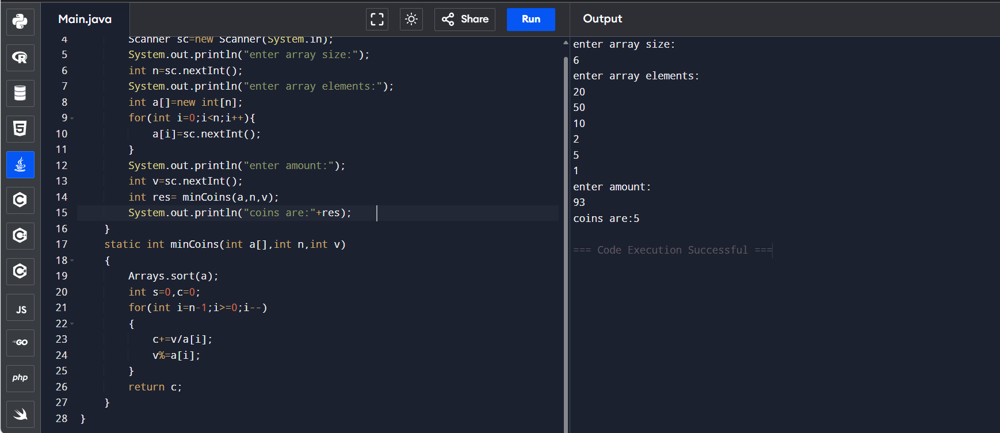
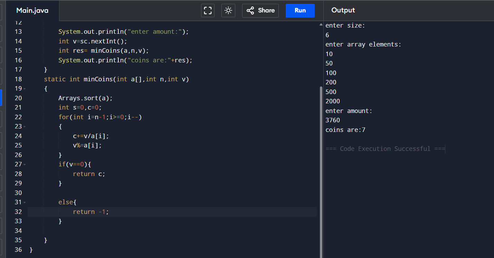
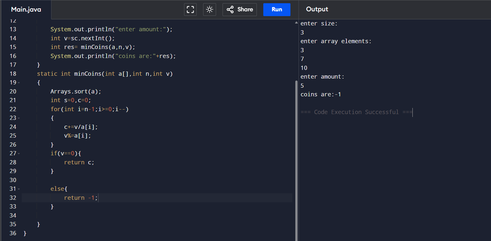

## 6.Coin change problem 1

```
import java.util.*;
class Main {
    public static void main(String[] args) {
        Scanner sc=new Scanner(System.in);
        System.out.println("enter n");
        int n=sc.nextInt();
        int a[]=new int[n];
        for(int i=0;i<n;i++)
        a[i]=sc.nextInt();
        System.out.println("enter amount");
        int v=sc.nextInt();
       int res= minCoins(a,n,v);
        System.out.println("coins are "+res);    
    }
    static int minCoins(int a[],int n,int v)
    {
        Arrays.sort(a);
        int s=0,c=0;
        for(int i=n-1;i>=0;i--)
        {
            c+=v/a[i];
            v%=a[i];
        }
        return c;
    }
}
```


```
import java.util.*;
class Main {
    public static void main(String[] args) {
        Scanner sc=new Scanner(System.in);
        System.out.println("enter n");
        int n=sc.nextInt();
        int a[]=new int[n];
        for(int i=0;i<n;i++)
        a[i]=sc.nextInt();
        System.out.println("enter amount");
        int v=sc.nextInt();
       int res= minCoins(a,n,v);
        System.out.println("coins are "+res);    
    }
    static int minCoins(int a[],int n,int v)
    {
        Arrays.sort(a);
        int s=0,c=0;
        for(int i=n-1;i>=0;i--)
        {
            c+=v/a[i];
            v%=a[i];
        }
        if(v==0)
        return c;
        else
        return -1;
    }
}
```



