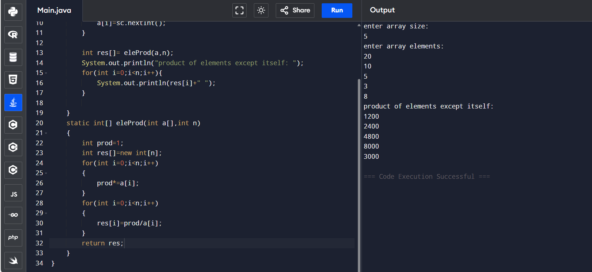

## 7.Product of array except itself.

```
import java.util.*;
class Main {
    public static void main(String[] args) {
        Scanner sc=new Scanner(System.in);
        System.out.println("enter n");
        int n=sc.nextInt();
        int a[]=new int[n];
        for(int i=0;i<n;i++)
        a[i]=sc.nextInt();
       int res[]= eleProd(a,n);
        System.out.println("product of elements except itself are ");    
       for(int i=0;i<n;i++)
        System.out.println(res[i]+" ");    
    }
    static int[] eleProd(int a[],int n)
    {
        int m=1;
        int res[]=new int[n];
        for(int i=0;i<n;i++)
        {
            m*=a[i];
        }
        for(int i=0;i<n;i++)
        {
            res[i]=m/a[i];
        }
        return res;
    }
}
```

